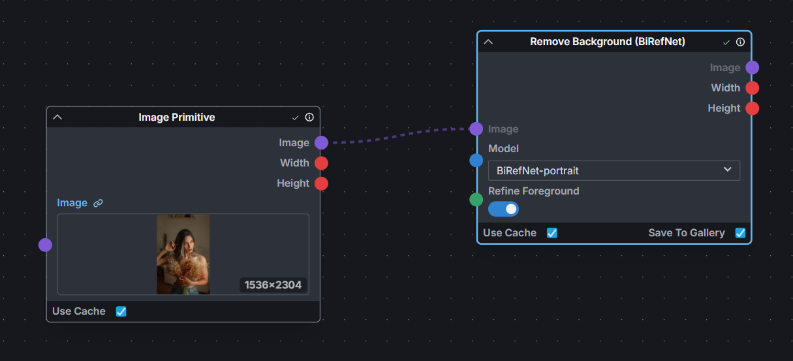

# Invoke BiRefNet

A custom node for [InvokeAI](https://github.com/invoke-ai/InvokeAI) that provides background removal using [BiRefNet (Bilateral Reference Network)](https://github.com/ZhengPeng7/BiRefNet), a high-quality segmentation model that separates foreground objects from their backgrounds.

---


<section>
  
  
</section>

---



## Installation

1. Copy or clone this repository into the `nodes` folder found in your Invoke install location
2. Install the following requirements through the launcher console:

```venv
uv pip install timm kornia
```

3. Restart Invoke and the node will appear in the image category under the name `Remove Background (BiRefNet)`.

## Notes

Models are downloaded from [Hugging Face](https://huggingface.co/ZhengPeng7/BiRefNet) on first use and cached locally. The initial run with a new model variant will take slightly longer while it downloads.
